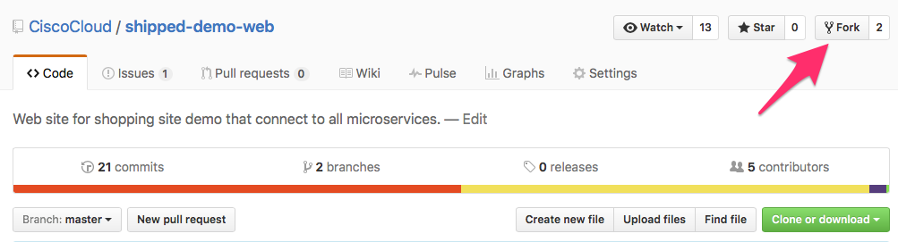
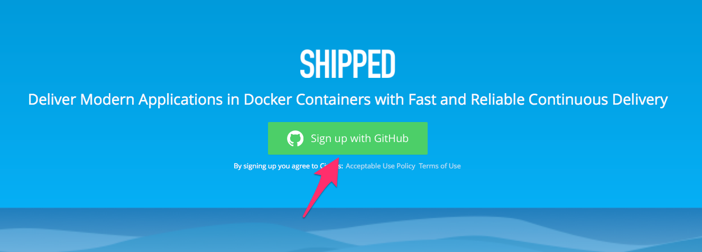
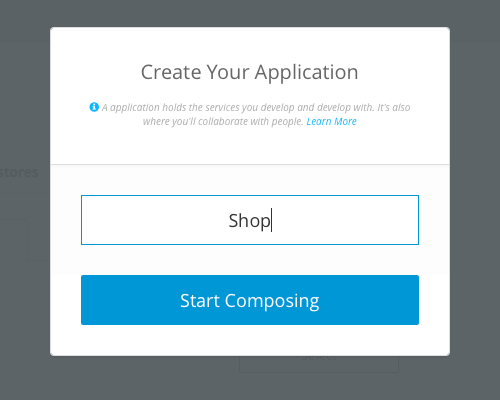
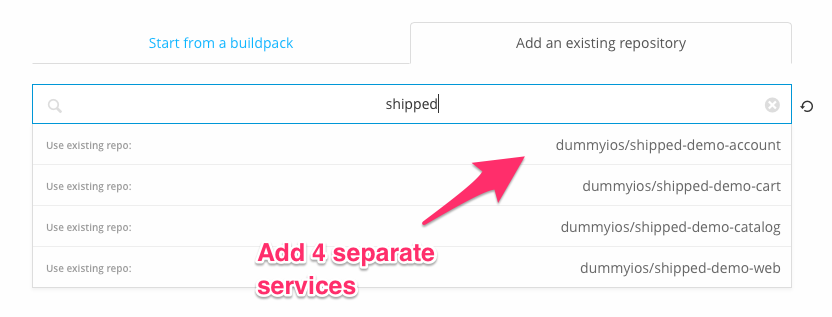
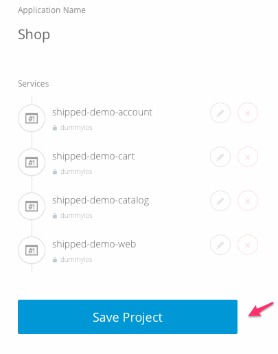
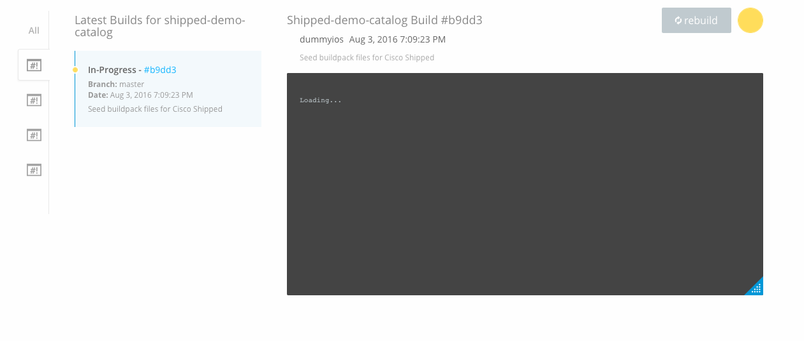
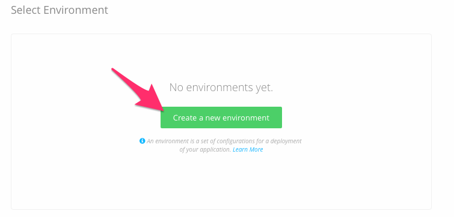
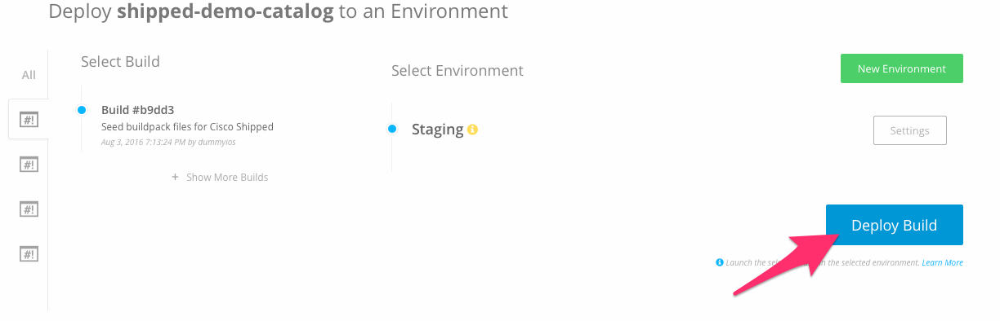
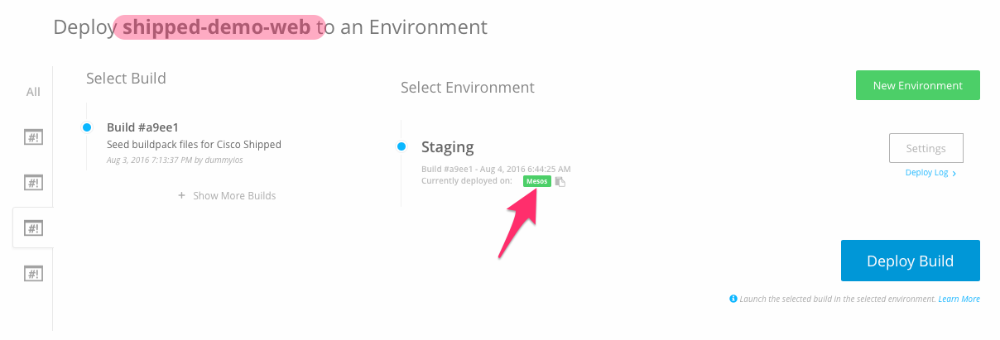
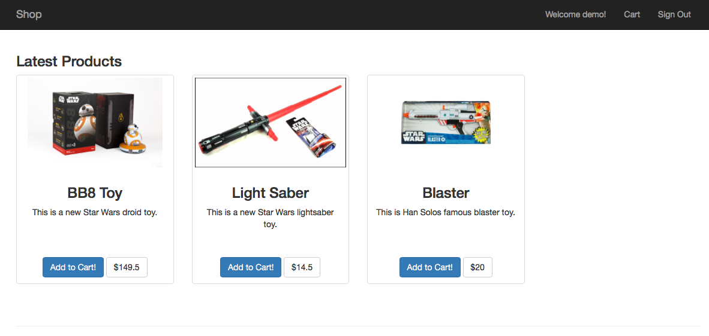

# Shopping Cart App Tutorial

## Overview
This is a small application  example of simple Shopping Cart API endpoint to be used with [Shipped](http://shipped-cisco.com).

## Getting Started
### 1. Fork the 4 repos below (This requires that you have a Github account. )
  - [Account](https://github.com/CiscoCloud/shipped-demo-account)
  - [Catalog](https://github.com/CiscoCloud/shipped-demo-catalog)
  - [Cart](https://github.com/CiscoCloud/shipped-demo-cart)
  - [Web](https://github.com/CiscoCloud/shipped-demo-web)

### 2. Once you have forked all 4 repos, head over to [Shipped](https://ciscoshipped.io)

### 3. Create your application.

### 4. You'll go to the compose tab next and add 4 services using existing repositories

### 5. While the containers are building, you can go ahead and setup your environment.

### 6. After creating your environment and the builds are finished, you can now deploy all builds to the environment you setup.

### 7. Once all 4 microservices are deployed go ahead and click the currently deployed button on the shipped-demo-web to see your fully connected application.

## Troubleshooting
* Make sure env variables are in environment.
* Contact [Nick Hayward](nhayward@cisco.com)
